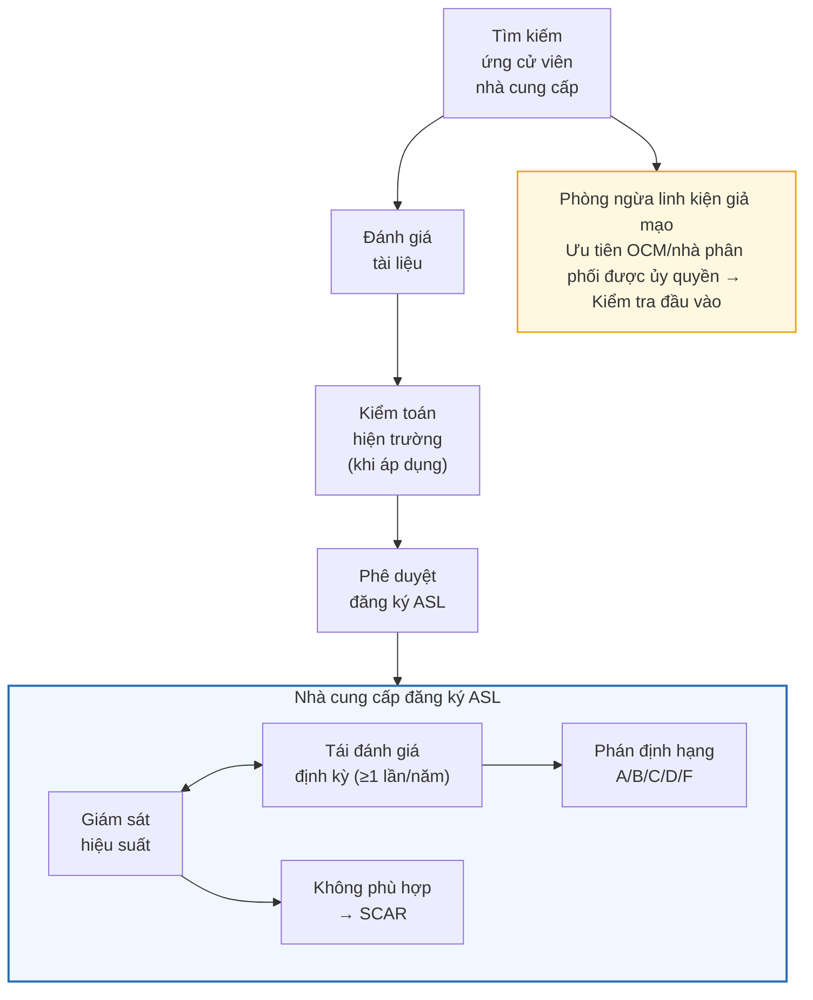

# Quy Trình Lựa Chọn/Đánh Giá/Quản Lý Nhà Cung Cấp Bên Ngoài
## External Provider Selection, Evaluation and Management Procedure

| Mục | Nội dung |
|-----|----------|
| Mã tài liệu | QP-808 |
| Số lần sửa đổi | Rev. 0 |
| Ngày ban hành | Tháng 5 năm 2026, ngày ___ |
| Tiêu chuẩn áp dụng | AS9100D Rev D, 8.4.1~8.4.3 |
| Mức độ bảo mật | Tài liệu nội bộ (Confidential) |
| Tài liệu cấp trên | QM-001 Sổ tay chất lượng §8.4 |

| Phân loại | Chức danh | Họ tên | Chữ ký | Ngày |
|-----------|-----------|--------|--------|------|
| Soạn thảo | Nhân viên bộ phận Mua hàng (PUR) | | | |
| Kiểm tra | Trưởng bộ phận Chất lượng | | | |
| Phê duyệt | Đại diện lãnh đạo chất lượng (QMR) | | | |

---

## Lịch sử sửa đổi

| Rev. | Ngày | Nội dung sửa đổi | Người soạn | Người phê duyệt |
|------|------|-----------------|------------|----------------|
| 0 | 2026-05-__ | Ban hành lần đầu (Soạn thảo mới hoàn toàn dựa trên AS9100D Rev D, phản ánh hành động khắc phục CAR-009/CAR-010) | | |

---

## Mục lục

1. [Mục đích](#1-mục-đích)
2. [Phạm vi áp dụng](#2-phạm-vi-áp-dụng)
3. [Tài liệu/tiêu chuẩn tham chiếu](#3-tài-liệutiêu-chuẩn-tham-chiếu)
4. [Thuật ngữ và định nghĩa](#4-thuật-ngữ-và-định-nghĩa)
5. [Trách nhiệm và quyền hạn](#5-trách-nhiệm-và-quyền-hạn)
6. [Hệ thống phân loại nhà cung cấp bên ngoài](#6-hệ-thống-phân-loại-nhà-cung-cấp-bên-ngoài)
7. [Thủ tục lựa chọn và đánh giá ban đầu nhà cung cấp](#7-thủ-tục-lựa-chọn-và-đánh-giá-ban-đầu-nhà-cung-cấp)
8. [Quy trình phê duyệt nhà cung cấp và đăng ký ASL](#8-quy-trình-phê-duyệt-nhà-cung-cấp-và-đăng-ký-asl)
9. [Giám sát và đánh giá định kỳ nhà cung cấp](#9-giám-sát-và-đánh-giá-định-kỳ-nhà-cung-cấp)
10. [Quản lý quy trình đặc biệt gia công bên ngoài](#10-quản-lý-quy-trình-đặc-biệt-gia-công-bên-ngoài)
11. [Phòng ngừa linh kiện giả mạo](#11-phòng-ngừa-linh-kiện-giả-mạo)
12. [Xử lý không phù hợp của nhà cung cấp và hành động khắc phục](#12-xử-lý-không-phù-hợp-của-nhà-cung-cấp-và-hành-động-khắc-phục)
13. [Yêu cầu đặc thù hàng không vũ trụ](#13-yêu-cầu-đặc-thù-hàng-không-vũ-trụ)
14. [Quản lý hồ sơ](#14-quản-lý-hồ-sơ)
15. [Tài liệu và biểu mẫu liên quan](#15-tài-liệu-và-biểu-mẫu-liên-quan)

---

# 1. Mục đích

Quy trình này quy định các thủ tục để lựa chọn, đánh giá, phê duyệt và quản lý có hệ thống tất cả các nhà cung cấp bên ngoài (External Provider) có ảnh hưởng đến sản phẩm hàng không vũ trụ tại Công ty TNHH M&C ELECTRONICS VIỆT NAM (sau đây gọi là M&C Electronics VINA).

Mục đích của quy trình này:
- Thiết lập quy trình quản lý nhà cung cấp bên ngoài theo yêu cầu AS9100D 8.4.1~8.4.3
- Thiết lập và vận hành hệ thống Danh sách nhà cung cấp được phê duyệt (ASL, Approved Supplier List)
- Áp dụng khác biệt mức độ quản lý nhà cung cấp theo phương pháp tiếp cận dựa trên rủi ro (Risk-Based Approach)
- Thiết lập tiêu chuẩn quản lý quy trình đặc biệt gia công bên ngoài (mạ/nhiệt luyện/kiểm tra không phá hủy, v.v.)
- Xây dựng hệ thống quản lý phòng ngừa linh kiện giả mạo (Counterfeit Parts)
- Thiết lập quy trình giám sát hiệu suất nhà cung cấp (chất lượng/tiến độ/dịch vụ) và đánh giá định kỳ
- Đảm bảo quyền truy cập cho khách hàng, nhà cung cấp do khách hàng chỉ định (Customer-Directed Source) và cơ quan chính phủ/quy định
- Thiết lập hệ thống truyền đạt (Flow-Down) yêu cầu đến cấp nhà cung cấp phụ (Sub-Tier Supplier)
- **Phản ánh hành động khắc phục CAR-009** (chưa lập ASL, không có lịch sử đánh giá nhà cung cấp)
- **Phản ánh hành động khắc phục CAR-010** (chưa thiết lập thủ tục quản lý quy trình đặc biệt gia công bên ngoài, không có tiêu chuẩn quản lý nhà gia công mạ/nhiệt luyện/kiểm tra không phá hủy)

> **Nội dung hành động khắc phục CAR-009**:
> - Nguyên nhân gốc rễ: Chính bản thân chế độ đánh giá/phê duyệt nhà cung cấp chưa được thiết lập, đặt hàng theo tiêu chí giá/tiến độ theo thói quen
> - Hành động khắc phục 1: Ban hành quy trình lựa chọn/đánh giá/quản lý nhà cung cấp bên ngoài (tài liệu này QP-808)
> - Hành động khắc phục 2: Soạn thảo ASL (Danh sách nhà cung cấp được phê duyệt) và thiết lập tiêu chí đăng ký (QF-808-02)
> - Hành động khắc phục 3: Thực hiện đánh giá hồi tố đối với các nhà cung cấp đang giao dịch (thực hiện đánh giá ban đầu)

> **Nội dung hành động khắc phục CAR-010**:
> - Nguyên nhân gốc rễ: Phân loại quy trình gia công bên ngoài như mua hàng thông thường và bỏ qua việc áp dụng yêu cầu chất lượng quy trình đặc biệt
> - Hành động khắc phục 1: Thiết lập thủ tục quản lý quy trình đặc biệt gia công bên ngoài (điều khoản 10 của tài liệu này)
> - Hành động khắc phục 2: Thiết lập tiêu chuẩn đăng ký ASL nhà gia công được phê duyệt — Ưu tiên nhà cung cấp có chứng nhận NADCAP
> - Hành động khắc phục 3: Thiết lập kế hoạch kiểm toán định kỳ nhà gia công (ít nhất 1 lần/năm)

---

# 2. Phạm vi áp dụng

Quy trình này áp dụng cho tất cả các nhà cung cấp bên ngoài có ảnh hưởng đến việc sản xuất, kiểm tra, dịch vụ sản phẩm hàng không vũ trụ tại M&C Electronics VINA.

| Phân loại | Đối tượng áp dụng |
|-----------|------------------|
| Nhà cung cấp nguyên liệu thô | Kim loại (nhôm, titan, inconel, v.v.), nhựa, hóa chất, nguyên phụ liệu |
| Nhà cung cấp linh kiện/cụm lắp ráp | Linh kiện điện tử, linh kiện cơ khí, đầu nối, vật liệu dây điện, tiêu chuẩn phẩm |
| Nhà cung cấp gia công bên ngoài | Gia công CNC, gia công kim loại tấm, đúc ép, lắp ráp và gia công thông thường khác |
| Nhà cung cấp quy trình đặc biệt | Mạ (Plating), nhiệt luyện (Heat Treatment), kiểm tra không phá hủy (NDT), hàn (Welding), sơn (Painting), xử lý hóa học (Chemical Processing) |
| Nhà cung cấp dịch vụ | Hiệu chuẩn (Calibration), đào tạo (Training), thử nghiệm (Testing), logistics |
| Nhà phân phối/đại lý | Nhà phân phối linh kiện điện tử (Authorized Distributor), đại lý nguyên liệu thô |

**Bộ phận áp dụng**: Mua hàng (PUR), Chất lượng, Sản xuất, Phát triển, Kế hoạch sản xuất (KHSX), Kinh doanh

**Loại trừ**: Văn phòng phẩm, dịch vụ gián tiếp như vệ sinh/nhà ăn không ảnh hưởng trực tiếp đến chất lượng sản phẩm được loại trừ khỏi phạm vi áp dụng của quy trình này; bộ phận mua hàng phán định và ghi chép việc áp dụng.

---

# 3. Tài liệu/tiêu chuẩn tham chiếu

| Tài liệu/Tiêu chuẩn | Nội dung |
|---------------------|----------|
| AS9100D Rev D | Yêu cầu hệ thống quản lý chất lượng hàng không vũ trụ (điều khoản 8.4.1~8.4.3) |
| AS9120B | Yêu cầu hệ thống quản lý chất lượng nhà phân phối hàng không vũ trụ |
| AS6081 | Linh kiện điện tử giả mạo/không phù hợp: Phòng ngừa, phát hiện và xử lý của nhà phân phối |
| AS6174 | Linh kiện giả mạo: Phòng ngừa trong việc thu mua (Acquisition) |
| AS6171 | Linh kiện điện tử giả mạo/không phù hợp: Phương pháp luận thử nghiệm |
| AS9102 Rev C | Yêu cầu kiểm tra bộ phận đầu tiên hàng không vũ trụ (FAI) |
| NADCAP (Nadcap) | Chương trình chứng nhận quy trình đặc biệt (do PRI, Performance Review Institute vận hành) |
| SAE AS7003 | Yêu cầu tránh linh kiện điện tử giả mạo cho người mua |
| DFARS 252.246-7007 | Yêu cầu phòng ngừa linh kiện điện tử giả mạo của Bộ Quốc phòng Hoa Kỳ (khi áp dụng) |
| QM-001 | Sổ tay chất lượng §8.4 Kiểm soát các quy trình, sản phẩm và dịch vụ do bên ngoài cung cấp |
| QP-801 | Quy trình quản lý hoạch định vận hành |
| QP-802 | Quy trình quản lý rủi ro vận hành (bao gồm FMEA) |
| QP-806 | Quy trình xem xét hợp đồng |
| QP-810 | Quy trình quản lý sản xuất và cung cấp dịch vụ |
| QP-818 | Quy trình quản lý đầu ra không phù hợp |
| QP-1001 | Quy trình quản lý không phù hợp/hành động khắc phục |
| QP-706 | Quy trình quản lý thông tin dạng văn bản |

---

# 4. Thuật ngữ và định nghĩa

| Thuật ngữ | Định nghĩa |
|-----------|-----------|
| Nhà cung cấp bên ngoài (External Provider) | Tổ chức bên ngoài tổ chức cung cấp một phần quy trình, sản phẩm hoặc dịch vụ. Bao gồm nhà cung cấp, nhà thầu phụ, nhà gia công bên ngoài |
| ASL (Approved Supplier List) | Danh sách nhà cung cấp được phê duyệt — Danh sách đăng ký nhà cung cấp bên ngoài đã được phê duyệt giao dịch sau khi vượt qua đánh giá ban đầu |
| QVL (Qualified Vendor List) | Danh sách nhà cung cấp đủ điều kiện — Danh sách nhà cung cấp do khách hàng chỉ định hoặc đã xác nhận đủ điều kiện cho sản phẩm/quy trình cụ thể |
| Quy trình đặc biệt (Special Process) | Quy trình mà kết quả đầu ra không thể xác nhận bằng giám sát hoặc đo lường tiếp theo, hoặc chỉ phát hiện ra khiếm khuyết sau khi sử dụng sản phẩm hoặc cung cấp dịch vụ (ví dụ: hàn, nhiệt luyện, mạ, kiểm tra không phá hủy, sơn, v.v.) |
| NADCAP (Nadcap) | National Aerospace and Defense Contractors Accreditation Program — Chương trình chứng nhận quy trình đặc biệt hàng không vũ trụ/quốc phòng do PRI vận hành |
| OASIS (Online Aerospace Supplier Information System) | Cơ sở dữ liệu thông tin nhà cung cấp hàng không vũ trụ do IAQG vận hành. Có thể tra cứu trạng thái chứng nhận nhà cung cấp, kết quả đánh giá, v.v. |
| Nhà cung cấp do khách hàng chỉ định (Customer-Directed Source) | Nhà cung cấp cụ thể mà khách hàng chỉ định/yêu cầu sử dụng trong hợp đồng/đơn đặt hàng |
| Linh kiện giả mạo (Counterfeit Part) | Linh kiện hoặc vật liệu mà nguồn gốc, vật liệu, hiệu suất, chứng nhận bị khai báo sai có chủ ý |
| Linh kiện nghi ngờ (Suspect Part) | Linh kiện mà không chắc chắn về việc giả mạo nhưng phát hiện dấu hiệu bất thường về nguồn gốc/ngoại quan/kết quả thử nghiệm |
| Nhà cung cấp phụ (Sub-Tier Supplier) | Nhà cung cấp gián tiếp cung cấp sản phẩm/dịch vụ cho nhà cung cấp trực tiếp (cấp 1) của công ty |
| Flow-Down | Truyền đạt các yêu cầu của khách hàng/quy định mà công ty nhận được cho nhà cung cấp phụ |
| OTD (On-Time Delivery) | Tỷ lệ giao hàng đúng hạn — Tỷ lệ tuân thủ ngày giao hàng thực tế so với ngày giao hàng đã thỏa thuận |
| PPM (Parts Per Million) | Số lượng lỗi trên một triệu — Chỉ tiêu thể hiện mức chất lượng giao hàng của nhà cung cấp |
| SCAR (Supplier Corrective Action Request) | Yêu cầu hành động khắc phục nhà cung cấp — Tài liệu yêu cầu phân tích nguyên nhân và hành động khắc phục khi xảy ra không phù hợp của nhà cung cấp |
| OCM/OEM | Original Component Manufacturer / Original Equipment Manufacturer — Nhà sản xuất gốc của linh kiện/thiết bị |
| Nhà phân phối được ủy quyền (Authorized Distributor) | Nhà phân phối bán lẻ được OCM/OEM chính thức ủy quyền |

---

# 5. Trách nhiệm và quyền hạn

| Chức danh/Bộ phận | Trách nhiệm và quyền hạn |
|-------------------|--------------------------|
| **Giám đốc (Director / Choi Byoung Youn)** | • Phê duyệt cuối cùng đăng ký ASL nhà cung cấp mới (phê duyệt đăng ký hệ thống G-Ware)<br>• Phê duyệt cuối cùng hợp đồng/giao dịch quan trọng liên quan đến nhà cung cấp<br>• Quyết định cuối cùng về duy trì/loại bỏ nhà cung cấp |
| **Đại diện lãnh đạo chất lượng (QMR)** | • Thiết lập tiêu chuẩn chất lượng ASL và phụ trách tổng hợp đánh giá nhà cung cấp<br>• Ra quyết định về các vấn đề chất lượng nghiêm trọng liên quan đến nhà cung cấp<br>• Phê duyệt xử lý khi phát hiện linh kiện giả mạo<br>• Hỗ trợ liên quan đến quyền truy cập của khách hàng/cơ quan quy định |
| **Quản lý bộ phận mua hàng (Purchasing Manager / Đặng Hoàng Hoa)** | • Phụ trách tổng hợp quản lý và vận hành ASL (PUR.04.05.03)<br>• Chủ trì lựa chọn nhà cung cấp/đánh giá ban đầu (tiêu chí Q.C.D: chất lượng·chi phí·tiến độ)<br>• Xác nhận nhà cung cấp đăng ký ASL khi đặt hàng mua<br>• Xem xét kết quả đánh giá tiến độ giao hàng (OTD) và hàng tháng của nhà cung cấp<br>• Soạn thảo báo cáo xem xét duy trì/loại bỏ nhà cung cấp và báo cáo lên Giám đốc |
| **Nhân viên bộ phận mua hàng (Bùi Khánh Ly và các nhân viên khác)** | • Thu thập thông tin nhà cung cấp (catalogue, website, giới thiệu đối tác, tài liệu nhà cung cấp tự nộp)<br>• Thu thập phiếu xác nhận thông tin nhà cung cấp (PUR.04.00.05) và đăng ký mới vào hệ thống G-Ware<br>• Ghi rõ yêu cầu chất lượng trong đơn đặt hàng (PO-PUR.04.00.01 nội địa / PUR.04.00.02 nước ngoài)<br>• Duy trì hồ sơ đánh giá hàng tháng nhà cung cấp (PUR.04.02.04)<br>• Phát hành "Thông báo yêu cầu cải tiến (Bảng thông báo yêu cầu cải tiến)" cho nhà cung cấp hạng C |
| **Bộ phận chất lượng (Bộ phận Chất lượng)** | • Thực hiện đánh giá chất lượng hiện trường nhà cung cấp (QPA - PUR.04.00.07 Vendor Qualification Checksheet)<br>• Thực hiện kiểm tra đầu vào (IQC) và cung cấp dữ liệu<br>• Phát hành SCAR khi xảy ra không phù hợp nhà cung cấp<br>• Xác nhận hiệu quả cải tiến nhà cung cấp hạng C, sau đó thông báo kết quả đánh giá cuối cùng cho bộ phận mua hàng<br>• Chủ trì cách ly và điều tra khi nghi ngờ linh kiện giả mạo |
| **Kho/Bộ phận vật tư (Bộ phận Kho NVL)** | • Xác nhận ban đầu số lượng và ngoại quan hàng nhập (trước giai đoạn IQC)<br>• Cách ly hàng nhập không phù hợp và thông báo cho bộ phận mua hàng<br>• Quản lý hồ sơ nhập hàng (PUR.02.01.02 & PUR.02.01.03) |
| **Bộ phận phát triển (R&D)** | • Tham gia đánh giá kỹ thuật nhà cung cấp linh kiện/vật liệu mới<br>• Xác nhận việc truyền đạt tài liệu kỹ thuật/bản vẽ cho nhà cung cấp<br>• Hỗ trợ xác định yêu cầu quy trình đặc biệt |

---

# 6. Hệ thống phân loại nhà cung cấp bên ngoài

## 6.1 Phân loại loại nhà cung cấp

M&C Electronics VINA đã quản lý nhà cung cấp theo phân loại dưới đây trong quy trình quản lý mua hàng/nhà cung cấp hiện có (PUR.02.00.01), và mở rộng điều này khi áp dụng AS9100D.

**Phân loại nhà cung cấp M&C hiện tại (theo tiêu chuẩn PUR.02.00.01)**:
- **Nhà cung cấp chỉ định (Nhà cung cấp chỉ định / NCCCĐ)**: Nhà cung cấp được khách hàng xác nhận mức độ hài lòng chất lượng và chỉ định. Duy trì giao dịch không cần đánh giá định kỳ
- **Nhà cung cấp nguyên liệu chính (Nhà cung cấp NL chính)**: Nhà cung cấp nguyên liệu thô cốt lõi do M&C tự lựa chọn. Áp dụng đánh giá định kỳ hàng năm và kiểm toán QPA hiện trường
- **Nhà cung cấp phụ liệu (Nhà cung cấp PL)**: Nhà cung cấp vật liệu tiêu hao/phụ trợ ngoài vật liệu chính. Áp dụng đánh giá theo dõi hàng tháng
- **Nhà cung cấp mới (Nhà cung cấp mới)**: Sau khi đăng ký mới vào hệ thống G-Ware và vượt qua đánh giá ban đầu (tiêu chí Q.C.D) thì đăng ký ASL

Theo yêu cầu hàng không vũ trụ AS9100D, mở rộng áp dụng phân loại trên như sau.

Phân loại nhà cung cấp bên ngoài theo các loại dưới đây và áp dụng khác biệt mức độ quản lý theo loại.

| Loại | Mã | Định nghĩa | Mức độ rủi ro | Mức độ quản lý |
|------|----|-----------|--------------|----------------|
| Nhà cung cấp nguyên liệu thô | SUP-RM | Cung cấp nguyên phụ liệu như kim loại, nhựa, hóa chất | Cao (High) | Level A |
| Nhà cung cấp linh kiện/cụm lắp ráp | SUP-CP | Linh kiện điện tử, linh kiện cơ khí, tiêu chuẩn phẩm, v.v. | Cao (High) | Level A |
| Nhà cung cấp gia công bên ngoài | SUP-OS | Gia công thông thường như CNC, kim loại tấm, đúc ép, lắp ráp | Trung bình (Medium) | Level B |
| Nhà cung cấp quy trình đặc biệt | SUP-SP | Mạ, nhiệt luyện, NDT, hàn, sơn, v.v. | Rất cao (Critical) | Level S |
| Nhà cung cấp dịch vụ | SUP-SV | Hiệu chuẩn, đào tạo, thử nghiệm, logistics, v.v. | Thấp~Trung bình | Level C |
| Nhà phân phối/đại lý | SUP-DT | Nhà phân phối linh kiện điện tử, đại lý nguyên liệu thô | Cao (High) | Level A |

## 6.2 Định nghĩa mức độ quản lý

| Mức độ quản lý | Đánh giá ban đầu | Kiểm toán hiện trường | Đánh giá định kỳ | Kiểm tra đầu vào | Quản lý linh kiện giả mạo |
|----------------|-----------------|----------------------|-----------------|-----------------|--------------------------|
| **Level S** (Quy trình đặc biệt) | Bắt buộc (tài liệu + hiện trường) | Bắt buộc (ít nhất 1 lần/năm) | 1 lần/năm | 100% hoặc xác nhận kết quả quy trình | Áp dụng khi liên quan |
| **Level A** (Rủi ro cao) | Bắt buộc (tài liệu + khuyến nghị hiện trường) | Ban đầu + dựa trên rủi ro | 1 lần/năm | Theo kế hoạch kiểm tra đầu vào | Áp dụng bắt buộc |
| **Level B** (Rủi ro trung bình) | Bắt buộc (tài liệu) | Dựa trên rủi ro | 1 lần/năm | Theo kế hoạch kiểm tra đầu vào | Áp dụng khi liên quan |
| **Level C** (Rủi ro thấp) | Tài liệu đơn giản hóa | Khi cần thiết | 2 năm/1 lần | Xác nhận kết quả dịch vụ | N/A |

## 6.3 Tiêu chí phân loại dựa trên rủi ro

Mức độ rủi ro mặc định theo loại nhà cung cấp tuân theo bảng trên, nhưng có thể điều chỉnh mức độ rủi ro của từng nhà cung cấp cụ thể xem xét các yếu tố sau:

| Yếu tố tăng trọng rủi ro | Điều kiện tăng rủi ro | Điều kiện giảm rủi ro |
|-------------------------|---------------------|---------------------|
| Mức độ ảnh hưởng sản phẩm | Linh kiện/quy trình liên quan đến an toàn bay (Flight Safety) | Phụ liệu không quan trọng |
| Khả năng thay thế nguồn cung | Nguồn cung đơn lẻ (Sole Source) | Có nhiều nguồn cung thay thế |
| Lịch sử chất lượng trước đây | Lịch sử không phù hợp nghiêm trọng, lịch sử thu hồi | Giao hàng không lỗi trong hơn 3 năm |
| Tình trạng chứng nhận hiện có | Không có chứng nhận hệ thống quản lý chất lượng | Có chứng nhận AS9100D / NADCAP |
| Quy mô giao dịch | Top 20% giá trị mua hàng hàng năm | Giao dịch đơn lẻ số lượng nhỏ |

---

# 7. Thủ tục lựa chọn và đánh giá ban đầu nhà cung cấp

## 7.1 Luồng quy trình đánh giá ban đầu

```
Phát sinh nhu cầu nhà cung cấp mới
        │
        ▼
[1] Tìm kiếm ứng cử viên nhà cung cấp và thu thập thông tin
        │
        ▼
[2] Đánh giá tài liệu (Sàng lọc điều kiện)
        │
        ▼
[3] Kiểm toán hiện trường (khi áp dụng)
        │
        ▼
[4] Đánh giá mẫu / Đặt hàng thử nghiệm (khi áp dụng)
        │
        ▼
[5] Tính điểm tổng hợp đánh giá ban đầu
        │
        ▼
[6] Phê duyệt/từ chối đăng ký ASL
```

## 7.2 Đánh giá tài liệu (Sàng lọc điều kiện)

Thực hiện đánh giá tài liệu dưới đây cho tất cả nhà cung cấp bên ngoài mới.

**Hạng mục đánh giá và điểm số** (tổng 100 điểm):

| Hạng mục đánh giá | Điểm | Tiêu chí đánh giá |
|------------------|------|------------------|
| Chứng nhận hệ thống quản lý chất lượng | 20 điểm | AS9100D: 20 điểm / ISO 9001: 15 điểm / Khác: 10 điểm / Không có: 0 điểm |
| Chứng nhận quy trình đặc biệt (khi áp dụng) | 15 điểm | NADCAP: 15 điểm / Phê duyệt khách hàng: 10 điểm / Tự chứng nhận: 5 điểm / Không có: 0 điểm |
| Ổn định kinh doanh | 10 điểm | Tình trạng tài chính lành mạnh, tính liên tục kinh doanh, tình trạng bảo hiểm |
| Năng lực kỹ thuật | 15 điểm | Tình trạng thiết bị, nhân lực kỹ thuật, năng lực sản xuất, tính phù hợp của tài liệu kỹ thuật |
| Năng lực quản lý chất lượng | 15 điểm | Thiết bị kiểm tra, quản lý hiệu chuẩn, quản lý sản phẩm không phù hợp, hệ thống truy xuất |
| Năng lực quản lý tiến độ | 10 điểm | Hệ thống lập kế hoạch sản xuất, thời gian dẫn, thành tích thực hiện tiến độ |
| Hệ thống phòng ngừa linh kiện giả mạo | 10 điểm | Thủ tục phòng ngừa linh kiện giả mạo, hệ thống thu mua OCM/nhà phân phối được ủy quyền, tuân theo AS6174/AS6081 |
| Tuân thủ môi trường/an toàn/pháp luật | 5 điểm | Chứng nhận môi trường, quản lý an toàn, tuân thủ pháp luật như REACH/RoHS |

**Tài liệu bắt buộc nộp khi đánh giá tài liệu**:
- Bản sao chứng nhận hệ thống quản lý chất lượng (AS9100D, ISO 9001, v.v.)
- Bản sao chứng nhận NADCAP (nhà cung cấp quy trình đặc biệt)
- Hồ sơ giới thiệu công ty (sơ đồ tổ chức, danh sách thiết bị chính, khách hàng chính)
- Báo cáo tài chính 3 năm gần nhất hoặc xác nhận đăng ký kinh doanh
- Thành tích quản lý chất lượng (tỷ lệ lỗi, lịch sử khiếu nại khách hàng)
- Tài liệu quy trình phòng ngừa linh kiện giả mạo (nhà cung cấp linh kiện điện tử/nguyên liệu thô)
- Xác nhận tình trạng đăng ký OASIS (khi áp dụng)

## 7.3 Tiêu chí kiểm toán hiện trường

Nhà cung cấp thuộc các điều kiện sau phải thực hiện bắt buộc kiểm toán hiện trường trước khi đăng ký ASL.

**Đối tượng bắt buộc kiểm toán hiện trường**:
- Level S (nhà cung cấp quy trình đặc biệt) — Tất cả nhà cung cấp
- Nhà cung cấp linh kiện liên quan đến an toàn bay (Flight Safety) trong Level A
- Nhà cung cấp nguồn cung đơn lẻ (Sole Source) trong Level A
- Ứng cử viên phê duyệt có điều kiện với điểm đánh giá tài liệu 60~69 điểm
- Nhà cung cấp không có chứng nhận hệ thống quản lý chất lượng
- Nhà cung cấp mà khách hàng yêu cầu kiểm toán hiện trường

**Hạng mục kiểm toán hiện trường**:

| Lĩnh vực kiểm toán | Nội dung xác nhận chính |
|-------------------|-----------------------|
| Hệ thống quản lý chất lượng | Thực trạng vận hành QMS, quản lý tài liệu, có thực hiện đánh giá nội bộ không |
| Quy trình sản xuất | Kiểm soát quy trình, vận hành hướng dẫn công việc, năng lực quy trình (Cpk) |
| Kiểm tra/thử nghiệm | Thiết bị kiểm tra, quản lý hiệu chuẩn, tiêu chuẩn kiểm tra, quản lý hồ sơ |
| Quản lý vật liệu | Kiểm tra đầu vào, môi trường bảo quản, FIFO (nhập trước xuất trước), truy xuất |
| Quy trình đặc biệt (khi áp dụng) | Chứng nhận quy trình, điều kiện nhân công, quản lý thông số quy trình, hồ sơ |
| Quản lý sản phẩm không phù hợp | Cách ly/ghi nhãn/xử lý, thủ tục hành động khắc phục, phòng ngừa tái phát |
| Phòng ngừa linh kiện giả mạo | Quản lý kênh thu mua, xác nhận đầu vào, thủ tục xử lý linh kiện nghi ngờ |
| Đóng gói/xuất xưởng | Tiêu chuẩn đóng gói, ghi nhãn, kiểm tra xuất xưởng, quản lý vận chuyển |

**Phán định kết quả kiểm toán hiện trường**:

| Phán định | Tiêu chí | Biện pháp |
|-----------|----------|----------|
| Phù hợp (Pass) | 0 không phù hợp nghiêm trọng, tối đa 3 không phù hợp nhỏ | Có thể đăng ký ASL |
| Phù hợp có điều kiện (Conditional) | 0 không phù hợp nghiêm trọng, từ 4 không phù hợp nhỏ trở lên | Đăng ký sau khi hoàn thành hành động khắc phục và xác nhận bằng văn bản |
| Không phù hợp (Fail) | Từ 1 không phù hợp nghiêm trọng trở lên | Không thể đăng ký ASL, tái kiểm toán sau khi khắc phục |

## 7.4 Đánh giá mẫu / Đặt hàng thử nghiệm

- Sau khi vượt qua đánh giá tài liệu và kiểm toán hiện trường (khi áp dụng), bộ phận mua hàng có thể thực hiện đặt hàng thử nghiệm (Trial Order).
- Thực hiện kiểm tra đầu vào đối với hàng giao từ đặt hàng thử nghiệm và phản ánh kết quả vào đánh giá ban đầu.
- Đối với nhà cung cấp quy trình đặc biệt, thực hiện xác nhận kết quả quy trình trên mẫu thử nghiệm (Test Specimen) hoặc linh kiện thực tế.

## 7.5 Phán định tổng hợp đánh giá ban đầu

| Điểm tổng hợp | Phán định | Biện pháp |
|--------------|----------|----------|
| Từ 80 điểm trở lên | **Phê duyệt (Approved)** | Phê duyệt đăng ký ASL |
| 60~79 điểm | **Phê duyệt có điều kiện (Conditional)** | Đăng ký sau khi nộp kế hoạch cải tiến, tái đánh giá trong 6 tháng |
| Dưới 60 điểm | **Từ chối (Rejected)** | Không thể đăng ký ASL, thông báo lý do |

---

# 8. Quy trình phê duyệt nhà cung cấp và đăng ký ASL

## 8.1 Thủ tục đăng ký ASL

```
Hoàn thành đánh giá ban đầu (Phê duyệt/Phê duyệt có điều kiện)
        │
        ▼
[1] Nhân viên bộ phận mua hàng: Soạn thảo đơn đăng ký ASL (QF-808-01)
        │
        ▼
[2] Trưởng bộ phận chất lượng: Ký xác nhận kết quả đánh giá chất lượng
        │
        ▼
[3] Trưởng bộ phận mua hàng: Xem xét và đề xuất đăng ký ASL
        │
        ▼
[4] QMR: Phê duyệt cuối cùng đăng ký ASL
        │
        ▼
[5] Đăng ký cơ sở dữ liệu ASL (QF-808-02)
        │
        ▼
[6] Thông báo yêu cầu chất lượng cho nhà cung cấp (QF-808-04)
```

## 8.2 Thông tin đăng ký ASL

ASL (QF-808-02) ghi chép và duy trì các thông tin sau.

| Hạng mục | Nội dung |
|----------|----------|
| Mã nhà cung cấp | Mã quản lý nội bộ |
| Tên nhà cung cấp | Tên pháp nhân chính thức (tiếng Anh/địa phương) |
| Loại cung cấp | SUP-RM / SUP-CP / SUP-OS / SUP-SP / SUP-SV / SUP-DT |
| Mức độ quản lý | Level S / A / B / C |
| Hạng mục/quy trình cung cấp | Phạm vi cung cấp được phê duyệt (hạng mục, vật liệu, quy trình, v.v.) |
| Tình trạng chứng nhận | Số chứng nhận và ngày hết hạn AS9100D / ISO 9001 / NADCAP, v.v. |
| Có đăng ký OASIS không | Số đăng ký (khi áp dụng) |
| Điểm đánh giá ban đầu | Điểm tổng hợp tài liệu + kiểm toán hiện trường + mẫu |
| Ngày phê duyệt | Ngày phê duyệt đăng ký ASL |
| Trạng thái phê duyệt | Approved / Conditional / Suspended / Removed |
| Ngày tái đánh giá định kỳ dự kiến | Thời điểm tái đánh giá định kỳ |
| Có phải nhà cung cấp do khách hàng chỉ định không | Khi là nhà cung cấp do khách hàng chỉ định: tên khách hàng/số hợp đồng |
| Ghi chú | Điểm đặc biệt, điều kiện hạn chế, v.v. |

## 8.3 Quản lý trạng thái ASL

| Trạng thái | Định nghĩa | Có thể đặt hàng không |
|-----------|-----------|----------------------|
| **Approved** | Vượt qua đánh giá, phê duyệt giao dịch bình thường | Có thể |
| **Conditional** | Phê duyệt có điều kiện, đang thực hiện cải tiến | Có thể giới hạn (với phê duyệt của trưởng bộ phận chất lượng) |
| **Suspended** | Dừng giao dịch (không phù hợp nghiêm trọng, chứng nhận hết hạn, v.v.) | Không thể |
| **Removed** | Xóa khỏi ASL (kết thúc giao dịch, giải thể, v.v.) | Không thể |

## 8.4 Cấm mua hàng từ nhà cung cấp chưa đăng ký

- **Nguyên tắc**: Cấm mua hàng từ nhà cung cấp chưa đăng ký vào ASL.
- **Ngoại lệ**: Trong trường hợp khẩn cấp (nguy cơ dừng dây chuyền sản xuất, v.v.) không thể tránh khỏi việc sử dụng nhà cung cấp chưa đăng ký, đặt hàng sau khi lấy phê duyệt trước của QMR và thực hiện kiểm tra đầu vào tăng cường cho hàng giao. Thực hiện đánh giá ban đầu cho nhà cung cấp đó trong vòng 30 ngày sau khi đặt hàng.

---

# 9. Giám sát và đánh giá định kỳ nhà cung cấp

## 9.1 Giám sát hiệu suất nhà cung cấp

Bộ phận mua hàng và bộ phận chất lượng liên tục giám sát hiệu suất của nhà cung cấp đăng ký ASL.

**Chỉ tiêu giám sát**:

| Chỉ tiêu | Phương pháp tính | Mức mục tiêu | Chu kỳ giám sát |
|----------|-----------------|-------------|----------------|
| Chất lượng giao hàng (Q-Score) | (Số LOT phù hợp / Tổng số LOT giao) × 100 | ≥ 98% | Hàng tháng |
| Tỷ lệ lỗi giao hàng (PPM) | (Số lượng lỗi / Tổng số lượng giao) × 1.000.000 | ≤ 500 PPM | Hàng tháng |
| Tỷ lệ giao hàng đúng hạn (OTD) | (Số lần giao đúng hạn / Tổng số lần giao) × 100 | ≥ 95% | Hàng tháng |
| Số lần phát hành SCAR | Số SCAR tích lũy theo quý | 0 lần | Hàng quý |
| Tỷ lệ thực hiện hành động khắc phục | (Số hoàn thành trong hạn / Tổng số SCAR) × 100 | 100% | Hàng quý |

## 9.2 Đánh giá định kỳ

### 9.2.1 Chu kỳ tái đánh giá

| Mức độ quản lý | Chu kỳ tái đánh giá | Phương pháp tái đánh giá |
|----------------|--------------------|-----------------------------|
| Level S | 1 lần/năm (Q1 hàng năm) | Tái đánh giá tài liệu + kiểm toán hiện trường |
| Level A | 1 lần/năm (Q1 hàng năm) | Tái đánh giá tài liệu + phân tích dữ liệu hiệu suất, kiểm toán hiện trường khi cần |
| Level B | 1 lần/năm (Q1 hàng năm) | Tái đánh giá tài liệu + phân tích dữ liệu hiệu suất |
| Level C | 2 năm/1 lần | Tái đánh giá tài liệu đơn giản hóa |

### 9.2.2 Hạng mục và điểm số tái đánh giá định kỳ (tổng 100 điểm)

| Hạng mục đánh giá | Điểm | Tiêu chí đánh giá |
|------------------|------|------------------|
| Thành tích chất lượng giao hàng | 30 điểm | Dựa trên dữ liệu Q-Score và PPM hàng tháng |
| Thành tích giao hàng đúng hạn | 20 điểm | Dựa trên dữ liệu OTD hàng tháng |
| Mức độ thực hiện hành động khắc phục | 15 điểm | Tính kịp thời và hiệu quả đáp ứng SCAR |
| Duy trì hệ thống quản lý chất lượng | 15 điểm | Hiệu lực chứng nhận, hoạt động cải tiến nội bộ |
| Năng lực đáp ứng kỹ thuật/dịch vụ | 10 điểm | Đáp ứng hỏi kỹ thuật, đáp ứng giao hàng khẩn, mức độ hợp tác |
| Tính cạnh tranh về giá | 10 điểm | Tính phù hợp giá so với thị trường, nỗ lực giảm chi phí |

### 9.2.3 Phán định tổng hợp tái đánh giá

| Điểm tổng hợp | Hạng | Biện pháp |
|--------------|------|----------|
| Từ 90 điểm trở lên | **A (Xuất sắc)** | Duy trì trạng thái hiện tại, ưu tiên đặt hàng |
| 80~89 điểm | **B (Tốt)** | Duy trì trạng thái hiện tại |
| 70~79 điểm | **C (Trung bình)** | Khuyến nghị cải tiến, tăng cường giám sát, thực hiện kiểm toán hiện trường tại lần tái đánh giá tiếp theo |
| 60~69 điểm | **D (Chưa đạt)** | Yêu cầu nộp kế hoạch cải tiến, tái đánh giá trong 3 tháng |
| Dưới 60 điểm | **F (Không đủ điều kiện)** | Xem xét dừng ASL (Suspended) hoặc xóa (Removed) |

### 9.2.4 Biện pháp kết quả tái đánh giá

- **Khi hạng giảm**: Trưởng bộ phận mua hàng yêu cầu nhà cung cấp cải thiện hiệu suất bằng văn bản và tiếp nhận kế hoạch cải tiến.
- **Hạng C trở xuống 2 lần liên tiếp**: Báo cáo QMR và quyết định có dừng ASL hay không.
- **Phán định hạng F**: Dừng ASL (Suspended) với sự phê duyệt của QMR và bắt đầu phát triển nhà cung cấp thay thế.
- Kết quả tái đánh giá được báo cáo như đầu vào cho xem xét lãnh đạo.

---

# 10. Quản lý quy trình đặc biệt gia công bên ngoài

> **Điều khoản này là thủ tục được thiết lập mới như hành động khắc phục CAR-010.**

## 10.1 Định nghĩa và phạm vi quy trình đặc biệt

Phân loại các quy trình sau là quy trình đặc biệt gia công bên ngoài và áp dụng yêu cầu quản lý của điều khoản này.

| Quy trình đặc biệt | Danh mục NADCAP tương ứng | Ví dụ tiêu chuẩn áp dụng |
|-------------------|--------------------------|--------------------------|
| Mạ (Plating) | Chemical Processing (CP) | MIL-DTL-5541, AMS-QQ-N-290, AMS 2404 |
| Nhiệt luyện (Heat Treatment) | Heat Treating (HT) | AMS 2759, AMS-H-6875 |
| Kiểm tra không phá hủy (NDT) | Non-Destructive Testing (NDT) | ASTM E1444, ASTM E2375, NAS 410 |
| Hàn (Welding) | Welding (WLD) | AWS D17.1, AMS-STD-1595 |
| Sơn/phủ (Painting/Coating) | Coatings (CTG) | MIL-PRF-85285, AMS-C-27725 |
| Xử lý hóa học (Chemical Processing) | Chemical Processing (CP) | MIL-DTL-5002, AMS 2480 |
| Gia công vật liệu composite (Composites) | Composites (COMP) | Khi áp dụng |
| Hàn/hàn đồng (Soldering/Brazing) | — | J-STD-001 (khi áp dụng) |

## 10.2 Tiêu chí lựa chọn nhà cung cấp quy trình đặc biệt

Khi lựa chọn nhà cung cấp quy trình đặc biệt (Level S), áp dụng thêm các yêu cầu dưới đây.

**Nguyên tắc ưu tiên nhà cung cấp có chứng nhận NADCAP**:
- Ưu tiên lựa chọn nhà cung cấp có chứng nhận NADCAP.
- Việc sử dụng nhà cung cấp không có chứng nhận NADCAP chỉ được phép khi đáp ứng tất cả các điều kiện sau:
  - (a) Chứng minh không có nhà cung cấp có chứng nhận NADCAP trong khu vực/quy trình tương ứng
  - (b) Xác nhận qua kiểm toán hiện trường rằng hệ thống chất lượng riêng vận hành ở mức AS9100D trở lên
  - (c) Có hồ sơ chứng nhận quy trình (Process Qualification) cho quy trình tương ứng
  - (d) Lấy phê duyệt bằng văn bản trước của khách hàng (khi yêu cầu khách hàng chỉ định NADCAP)
  - (e) Phê duyệt QMR

**Hạng mục đánh giá ban đầu bổ sung cho nhà cung cấp quy trình đặc biệt**:

| Hạng mục đánh giá bổ sung | Điểm | Điểm xác nhận |
|--------------------------|------|--------------|
| Có chứng nhận NADCAP | 20 điểm | Ngày hết hạn chứng nhận, phạm vi chứng nhận (Scope), có Merit hay không |
| Tình trạng chứng nhận quy trình | 15 điểm | Hồ sơ chứng nhận (Qualification) theo từng quy trình/vật liệu |
| Kế hoạch kiểm soát quy trình | 15 điểm | Quản lý thông số quy trình, vận hành SPC, quản lý môi trường |
| Chứng nhận điều kiện nhân công | 10 điểm | Tình trạng bằng cấp như NAS 410 / SNT-TC-1A (NDT), v.v. |
| Thiết bị thử nghiệm/năng lực | 10 điểm | Thiết bị thử nghiệm có sẵn, quản lý hiệu chuẩn, năng lực thử nghiệm |

## 10.3 Yêu cầu ghi rõ khi đặt hàng quy trình đặc biệt

Trong đơn đặt hàng (PO) gia công bên ngoài quy trình đặc biệt, bắt buộc ghi rõ các nội dung sau:

| Nội dung bắt buộc ghi rõ | Nội dung |
|-------------------------|----------|
| Tài liệu kỹ thuật/tiêu chuẩn áp dụng | Số tài liệu kỹ thuật quy trình và phiên bản (ví dụ: MIL-DTL-5541 Type I, Class 3) |
| Thông tin vật liệu/nguyên liệu | Vật liệu đối tượng xử lý, điều kiện nhiệt luyện, v.v. |
| Yêu cầu quy trình | Yêu cầu thông số quy trình cụ thể như nhiệt độ, thời gian, độ dày, độ bền |
| Yêu cầu kiểm tra/thử nghiệm | Các hạng mục kiểm tra/thử nghiệm cần thiết và tiêu chí đánh giá |
| Yêu cầu nộp biên bản | Phạm vi nộp CoC (chứng nhận phù hợp), biên bản thử nghiệm, hồ sơ quy trình |
| Yêu cầu truy xuất | Duy trì trạng thái có thể truy xuất số lô, số mẻ |
| Yêu cầu hàng không vũ trụ | Yêu cầu tuân theo AS9100D, các nội dung Flow-Down |
| Yêu cầu do khách hàng chỉ định | Yêu cầu bổ sung được ghi rõ trong PO/tài liệu kỹ thuật của khách hàng (khi áp dụng) |
| Quyền truy cập | Quyền truy cập cơ sở và xem xét hồ sơ của công ty, khách hàng, cơ quan quy định |

## 10.4 Kiểm tra đầu vào hàng giao quy trình đặc biệt

- Bắt buộc xác nhận CoC (chứng nhận phù hợp) đối với hàng giao quy trình đặc biệt.
- CoC phải ghi rõ tài liệu kỹ thuật áp dụng, điều kiện quy trình, kết quả thử nghiệm, phán định đạt.
- Bộ phận chất lượng quyết định mức độ kiểm tra đầu vào dựa trên rủi ro; thực hiện kiểm tra tăng cường sau lần giao đầu tiên và sau không phù hợp nghiêm trọng.
- Khi gia công NDT bên ngoài, xác nhận chữ ký nhân công đủ điều kiện chứng nhận trên biên bản thử nghiệm.

## 10.5 Kiểm toán nhà cung cấp quy trình đặc biệt

- Thực hiện ít nhất 1 lần kiểm toán định kỳ/năm đối với nhà cung cấp Level S.
- Sử dụng danh sách kiểm tra NADCAP hoặc danh sách kiểm tra kiểm toán quy trình đặc biệt nội bộ (QF-808-07) khi kiểm toán.
- Khi phát hiện không phù hợp trong kiểm toán, phát hành SCAR và theo dõi việc thực hiện hành động khắc phục.
- Đối với nhà cung cấp có chứng nhận NADCAP, giám sát kết quả kiểm toán chứng nhận PRI (Merit/Non-Merit/Revocation) và thực hiện biện pháp phù hợp khi trạng thái chứng nhận thay đổi.

---

# 11. Phòng ngừa linh kiện giả mạo

## 11.1 Chính sách phòng ngừa linh kiện giả mạo

M&C Electronics VINA thực hiện quản lý có hệ thống để ngăn chặn sự xâm nhập của linh kiện giả mạo (Counterfeit Parts) và linh kiện nghi ngờ (Suspect Parts) nhằm đảm bảo an toàn và độ tin cậy của sản phẩm hàng không vũ trụ.

## 11.2 Tiêu chuẩn áp dụng

| Tiêu chuẩn | Đối tượng áp dụng |
|-----------|------------------|
| AS6174 | Phòng ngừa linh kiện giả mạo — Yêu cầu khi thu mua (Acquisition) bộ phận |
| AS6081 | Linh kiện điện tử giả mạo/không phù hợp — Phòng ngừa, phát hiện và xử lý của nhà phân phối |
| AS6171 | Linh kiện điện tử giả mạo/không phù hợp — Phương pháp luận thử nghiệm |
| SAE AS7003 | Yêu cầu tránh linh kiện điện tử giả mạo cho người mua |
| DFARS 252.246-7007 | Phòng ngừa linh kiện điện tử giả mạo của Bộ Quốc phòng Hoa Kỳ (khi áp dụng theo hợp đồng) |

## 11.3 Nguyên tắc thu mua phòng ngừa linh kiện giả mạo

1. **Ưu tiên mua trực tiếp từ OCM/OEM**: Nguyên tắc mua linh kiện trực tiếp từ OCM (Original Component Manufacturer) hoặc OEM.
2. **Sử dụng nhà phân phối được ủy quyền**: Khi không thể mua trực tiếp từ OCM, mua qua nhà phân phối được OCM ủy quyền (Authorized Distributor).
3. **Hạn chế sử dụng nhà phân phối không được ủy quyền**: Về nguyên tắc cấm mua từ nhà phân phối không được ủy quyền (Independent Distributor/Broker). Trong trường hợp không thể tránh khỏi, phải đáp ứng tất cả các điều kiện dưới đây:
   - (a) Lập tài liệu lý do không thể thu mua từ OCM và nhà phân phối được ủy quyền
   - (b) Phê duyệt trước của QMR
   - (c) Thực hiện kiểm tra đầu vào tăng cường và thử nghiệm linh kiện giả mạo (theo AS6171)
   - (d) Xác nhận có thể truy xuất lịch sử linh kiện (Chain of Custody)

## 11.4 Thủ tục phát hiện linh kiện giả mạo

### 11.4.1 Kiểm tra linh kiện giả mạo khi kiểm tra đầu vào

Kiểm tra các hạng mục sau khi kiểm tra đầu vào để ngăn chặn sự xâm nhập linh kiện giả mạo:

| Hạng mục kiểm tra | Nội dung xác nhận |
|------------------|-----------------|
| Đóng gói/nhãn | Đóng gói chính hãng OCM, xác thực nhãn, xác nhận ngày sản xuất/số lô |
| Kiểm tra ngoại quan | Tình trạng ghi nhãn, tình trạng chân/chốt, dấu hiệu tái gia công, có blacktopping không |
| Xác nhận tài liệu | CoC (chứng nhận phù hợp), biên bản thử nghiệm, chứng nhận xuất xứ, tài liệu truy xuất lịch sử |
| Kênh phân phối | Xác nhận kênh phân phối OCM → nhà phân phối được ủy quyền → công ty |
| Dữ liệu linh kiện | Có phù hợp ngoại hình/quy cách so với data sheet OCM không |

### 11.4.2 Thủ tục xử lý khi nghi ngờ linh kiện giả mạo

```
Phát hiện linh kiện giả mạo/nghi ngờ
        │
        ▼
[1] Cách ly ngay lập tức (dán thẻ đỏ, bảo quản trong khu vực cách ly)
        │
        ▼
[2] Báo cáo Trưởng bộ phận chất lượng → Báo cáo QMR
        │
        ▼
[3] Thực hiện thử nghiệm xác nhận bổ sung (XRF, decapsulation, X-ray, v.v.)
        │
        ▼
[4] Khi xác nhận giả mạo:
    ├→ [4a] Thông báo nhà cung cấp và phát hành SCAR
    ├→ [4b] Cách ly toàn bộ lô tương ứng và trả lại/tiêu hủy
    ├→ [4c] Thông báo khách hàng (trong trường hợp đã giao hàng)
    ├→ [4d] Báo cáo cơ quan chính phủ/quy định liên quan (khi áp dụng)
    ├→ [4e] Báo cáo GIDEP Alert hoặc ERAI (khi áp dụng)
    └→ [4f] Dừng hoặc xóa nhà cung cấp tương ứng khỏi ASL
```

## 11.5 Đào tạo phòng ngừa linh kiện giả mạo

- Thực hiện ít nhất 1 lần/năm đào tạo phòng ngừa linh kiện giả mạo cho bộ phận mua hàng, bộ phận chất lượng (phụ trách kiểm tra đầu vào), nhân viên kho.
- Nội dung đào tạo: Các loại và đặc điểm linh kiện giả mạo, kỹ thuật kiểm tra bằng mắt, thủ tục báo cáo linh kiện nghi ngờ, quản lý kênh thu mua

---

# 12. Xử lý không phù hợp của nhà cung cấp và hành động khắc phục

## 12.1 Loại không phù hợp của nhà cung cấp

| Loại | Định nghĩa | Mức độ xử lý |
|------|-----------|-------------|
| Không phù hợp chất lượng | Dưới tiêu chuẩn/quy cách, lỗi kích thước, lỗi chức năng, v.v. | Phát hành SCAR |
| Không phù hợp tiến độ | Không tuân thủ tiến độ giao hàng đã thỏa thuận (trễ hoặc giao sớm) | Cảnh báo bằng văn bản → SCAR khi lặp lại |
| Không phù hợp tài liệu | Thiếu CoC, không nộp biên bản thử nghiệm, thiếu tài liệu truy xuất | Trả lại hoặc yêu cầu bổ sung → SCAR khi lặp lại |
| Linh kiện giả mạo/nghi ngờ | Giao linh kiện giả mạo hoặc nghi ngờ | SCAR + xem xét dừng/xóa ASL |
| Không phù hợp quy trình đặc biệt | Không tuân thủ thông số quy trình, thực hiện ngoài phạm vi chứng nhận, v.v. | SCAR + kiểm toán hiện trường |

## 12.2 Thủ tục xử lý SCAR (Yêu cầu hành động khắc phục nhà cung cấp)

```
Xảy ra không phù hợp / Không đạt kiểm tra đầu vào
        │
        ▼
[1] Bộ phận chất lượng: Xác nhận và ghi chép nội dung không phù hợp
        │
        ▼
[2] Trưởng bộ phận chất lượng: Quyết định phát hành SCAR (trường hợp nhỏ thì cảnh báo bằng văn bản)
        │
        ▼
[3] Bộ phận chất lượng: Soạn thảo SCAR và gửi cho nhà cung cấp (QF-808-05)
    ├── Nội dung không phù hợp, bằng chứng liên quan
    ├── Yêu cầu hành động khắc phục
    └── Hạn trả lời: Trong vòng 10 ngày làm việc kể từ ngày phát hành
        │
        ▼
[4] Nhà cung cấp: Nộp phân tích nguyên nhân + kế hoạch hành động khắc phục
        │
        ▼
[5] Bộ phận chất lượng: Xem xét tính phù hợp của hành động khắc phục
    ├── Phù hợp: Giám sát thực hiện hành động khắc phục
    └── Không phù hợp: Yêu cầu nộp lại (1 cơ hội bổ sung)
        │
        ▼
[6] Xác nhận thực hiện hành động khắc phục và xác nhận hiệu quả
        │
        ▼
[7] Kết thúc SCAR (Phê duyệt trưởng bộ phận chất lượng)
```

## 12.3 Tiêu chí xử phạt nhà cung cấp

| Điều kiện | Biện pháp xử phạt |
|----------|-----------------|
| Không trả lời SCAR (vượt quá hạn từ 2 lần trở lên) | Cảnh báo dừng ASL (Suspended) |
| Tái phát không phù hợp tương tự (từ 3 lần trở lên trong 12 tháng) | Dừng ASL (Suspended) |
| Không phù hợp chất lượng nghiêm trọng (ảnh hưởng an toàn/chức năng) | Dừng ASL ngay lập tức + yêu cầu dừng xuất xưởng |
| Xác nhận giao linh kiện giả mạo | Xóa ASL ngay lập tức (Removed) |
| Thất bại thực hiện hành động khắc phục SCAR (không hoàn thành vượt quá 90 ngày) | Dừng ASL → Xóa khi không hoàn thành vượt quá 180 ngày |

## 12.4 Thủ tục phục hồi nhà cung cấp

- Khi nhà cung cấp bị dừng ASL (Suspended) yêu cầu phục hồi, phục hồi sau khi nộp bằng chứng hoàn thành hành động khắc phục và vượt qua kiểm toán hiện trường của bộ phận chất lượng, có phê duyệt QMR.
- Việc đăng ký lại nhà cung cấp bị xóa ASL (Removed) phải thực hiện lại toàn bộ thủ tục trước đánh giá ban đầu sau ít nhất 12 tháng.

---

# 13. Yêu cầu đặc thù hàng không vũ trụ

## 13.1 Nhà cung cấp do khách hàng chỉ định (Customer-Directed Source)

- Khi khách hàng chỉ định sử dụng nhà cung cấp cụ thể trong hợp đồng/PO, đăng ký nhà cung cấp đó vào ASL ở trạng thái "do khách hàng chỉ định (Customer-Directed)".
- Cũng thực hiện đánh giá ban đầu theo quy trình này đối với nhà cung cấp do khách hàng chỉ định. Tuy nhiên, không phân biệt với kết quả đánh giá, sử dụng theo chỉ thị của khách hàng và thông báo bằng văn bản cho khách hàng về rủi ro được phát hiện trong đánh giá.
- Khi xảy ra không phù hợp của nhà cung cấp do khách hàng chỉ định, thông báo ngay lập tức cho khách hàng đó và cùng triển khai hành động khắc phục.
- Nhận thức rằng việc sử dụng nhà cung cấp do khách hàng chỉ định không miễn trách nhiệm chất lượng của công ty (Ghi chú AS9100D 8.4.1).

## 13.2 Quyền truy cập của cơ quan chính phủ/quy định (Right of Access)

- Đảm bảo quyền của khách hàng của công ty, khách hàng của khách hàng, đại diện chính phủ, cơ quan quy định (ví dụ: EASA, FAA, CAAV, v.v.) được truy cập vào cơ sở của nhà cung cấp với các mục đích sau:
  - Xác nhận hệ thống quản lý chất lượng
  - Kiểm tra sản phẩm/quy trình
  - Xem xét hồ sơ
  - Thực hiện kiểm toán
- Ghi rõ điều khoản quyền truy cập trong tất cả các đơn đặt hàng (PO):
  > "Nhà cung cấp phải đảm bảo quyền của khách hàng M&C, đại diện của khách hàng M&C, đại diện chính phủ và cơ quan quy định được truy cập vào cơ sở, thiết bị, quy trình, công việc, nhân lực, hồ sơ, v.v. liên quan đến đơn đặt hàng này để kiểm tra và xác nhận."

## 13.3 Truyền đạt yêu cầu đến nhà cung cấp phụ (Flow-Down)

- Bắt buộc truyền đạt các yêu cầu sau đến cấp nhà cung cấp phụ (Sub-Tier Supplier) trong đơn đặt hàng (PO):
  - (a) Tài liệu kỹ thuật/tiêu chuẩn áp dụng và phiên bản
  - (b) Yêu cầu phê duyệt sản phẩm/quy trình
  - (c) Yêu cầu chứng nhận điều kiện nhân lực
  - (d) Yêu cầu hệ thống quản lý chất lượng
  - (e) Yêu cầu nhận dạng và quản lý đặc tính trọng yếu (Key Characteristics)
  - (f) Yêu cầu thử nghiệm/kiểm tra/xác nhận
  - (g) Yêu cầu phòng ngừa linh kiện giả mạo
  - (h) Yêu cầu thông báo linh kiện không phù hợp
  - (i) Yêu cầu thông báo trước khi thay đổi (thay đổi quy trình, sản phẩm, cơ sở, nhà cung cấp)
  - (j) Quyền truy cập (Right of Access) của công ty, khách hàng, cơ quan quy định
  - (k) Yêu cầu lưu giữ hồ sơ
  - (l) Yêu cầu đặc biệt do khách hàng chỉ định (khi áp dụng)

## 13.4 Nghĩa vụ thông báo thay đổi của nhà cung cấp

- Nhà cung cấp phải thông báo trước cho công ty trước khi giao hàng về các thay đổi sau, và điều này được ghi rõ trong đơn đặt hàng (PO):
  - Thay đổi thiết kế/quy cách sản phẩm
  - Thay đổi quy trình sản xuất
  - Di chuyển hoặc thay đổi cơ sở/thiết bị sản xuất
  - Thay đổi nhà cung cấp phụ (Sub-Tier)
  - Thay đổi trạng thái chứng nhận hệ thống quản lý chất lượng (hết hạn, hủy bỏ, thay đổi phạm vi)
  - Thay đổi trạng thái chứng nhận NADCAP (khi áp dụng)
- Khi tiếp nhận thông báo thay đổi của nhà cung cấp, công ty đánh giá ảnh hưởng của thay đổi đến chất lượng sản phẩm và thực hiện tái phê duyệt (Re-qualification) khi cần thiết.

## 13.5 Quản lý hiệu suất giao hàng của nhà cung cấp (Delivery Performance)

- Theo AS9100D 8.4.3, giám sát hiệu suất giao hàng của nhà cung cấp.
- Yêu cầu biện pháp cải tiến đối với nhà cung cấp có OTD (tỷ lệ giao hàng đúng hạn) dưới mục tiêu (95%).
- Sử dụng dữ liệu hiệu suất giao hàng của nhà cung cấp như đầu vào cho tái đánh giá định kỳ và xem xét lãnh đạo.

## 13.6 Sử dụng cơ sở dữ liệu OASIS

- Khi lựa chọn nhà cung cấp, tham chiếu cơ sở dữ liệu IAQG OASIS để xác nhận tình trạng chứng nhận, kết quả đánh giá, lịch sử hành động khắc phục, v.v. của nhà cung cấp đó.
- Định kỳ (1 lần/quý) xác nhận biến động trạng thái chứng nhận (hủy bỏ chứng nhận, dừng, v.v.) của nhà cung cấp đăng ký trong OASIS.

---

# 14. Quản lý hồ sơ

## 14.1 Danh sách hồ sơ liên quan

| Tên hồ sơ | Số biểu mẫu | Thời hạn lưu giữ | Bộ phận chịu trách nhiệm |
|-----------|------------|-----------------|--------------------------|
| Phiếu đánh giá ban đầu nhà cung cấp | QF-808-01 | 10 năm sau khi kết thúc giao dịch | Bộ phận mua hàng |
| Danh sách nhà cung cấp được phê duyệt (ASL) | QF-808-02 | Vĩnh viễn (quản lý lịch sử) | Bộ phận mua hàng |
| Báo cáo kiểm toán hiện trường nhà cung cấp | QF-808-03 | 10 năm sau khi kết thúc giao dịch | Bộ phận chất lượng |
| Thông báo yêu cầu chất lượng nhà cung cấp | QF-808-04 | 10 năm sau khi kết thúc giao dịch | Bộ phận mua hàng |
| SCAR (Yêu cầu hành động khắc phục nhà cung cấp) | QF-808-05 | 10 năm sau khi kết thúc giao dịch | Bộ phận chất lượng |
| Báo cáo tái đánh giá định kỳ nhà cung cấp | QF-808-06 | 10 năm sau khi kết thúc giao dịch | Bộ phận mua hàng/chất lượng |
| Danh sách kiểm tra kiểm toán nhà cung cấp quy trình đặc biệt | QF-808-07 | 10 năm sau khi kết thúc giao dịch | Bộ phận chất lượng |
| Báo cáo điều tra linh kiện giả mạo | QF-808-08 | 15 năm sau khi kết thúc giao dịch | Bộ phận chất lượng |
| Báo cáo giám sát hiệu suất nhà cung cấp (tháng/quý) | QF-808-09 | 5 năm | Bộ phận mua hàng/chất lượng |
| Đơn đặt hàng (PO) và tài liệu đính kèm | — | 10 năm sau khi kết thúc hợp đồng | Bộ phận mua hàng |

## 14.2 Nguyên tắc quản lý hồ sơ

- Tất cả hồ sơ được quản lý theo QP-706 (quy trình quản lý thông tin dạng văn bản).
- Đảm bảo tính toàn vẹn dữ liệu bao gồm cả bản sao lưu cho hồ sơ điện tử.
- Tuân theo yêu cầu của cơ quan quy định hàng không vũ trụ hoặc khách hàng nếu yêu cầu thời hạn lưu giữ dài hơn.
- Lưu giữ tối thiểu 15 năm đối với hồ sơ liên quan đến linh kiện giả mạo.

---

# 15. Tài liệu và biểu mẫu liên quan

## 15.1 Quy trình liên quan

| Mã tài liệu | Tên tài liệu | Sự liên quan |
|------------|-------------|-------------|
| QM-001 | Sổ tay chất lượng | Tài liệu cấp trên (§8.4) |
| QP-801 | Quy trình quản lý hoạch định vận hành | Kết nối quản lý nhà cung cấp bên ngoài khi lập kế hoạch sản xuất |
| QP-802 | Quy trình quản lý rủi ro vận hành | Kết nối đánh giá rủi ro nhà cung cấp |
| QP-806 | Quy trình xem xét hợp đồng | Nhận dạng các nội dung liên quan đến nhà cung cấp trong yêu cầu khách hàng |
| QP-810 | Quy trình quản lý sản xuất và cung cấp dịch vụ | Kết nối quản lý quy trình gia công bên ngoài |
| QP-818 | Quy trình quản lý đầu ra không phù hợp | Kết nối xử lý không phù hợp kiểm tra đầu vào |
| QP-1001 | Quy trình quản lý không phù hợp/hành động khắc phục | Kết nối quy trình xử lý SCAR |
| QP-706 | Quy trình quản lý thông tin dạng văn bản | Tiêu chuẩn lưu giữ hồ sơ |

## 15.2 Danh sách biểu mẫu

| Số biểu mẫu | Tên biểu mẫu | Mục đích sử dụng |
|------------|-------------|----------------|
| QF-808-01 | Phiếu đánh giá ban đầu nhà cung cấp bên ngoài | Ghi chép kết quả đánh giá tài liệu/hiện trường nhà cung cấp mới |
| QF-808-02 | Danh sách nhà cung cấp được phê duyệt (ASL) | Đăng ký/quản lý nhà cung cấp được phê duyệt |
| QF-808-03 | Báo cáo kiểm toán hiện trường nhà cung cấp | Ghi chép kết quả kiểm toán hiện trường |
| QF-808-04 | Thông báo yêu cầu chất lượng nhà cung cấp | Truyền đạt yêu cầu chất lượng cho nhà cung cấp |
| QF-808-05 | SCAR (Yêu cầu hành động khắc phục nhà cung cấp) | Yêu cầu hành động khắc phục khi có không phù hợp nhà cung cấp |
| QF-808-06 | Báo cáo tái đánh giá định kỳ nhà cung cấp | Ghi chép kết quả tái đánh giá định kỳ |
| QF-808-07 | Danh sách kiểm tra kiểm toán nhà cung cấp quy trình đặc biệt | Sử dụng khi kiểm toán nhà cung cấp quy trình đặc biệt |
| QF-808-08 | Báo cáo điều tra linh kiện giả mạo | Ghi chép điều tra khi phát hiện linh kiện giả mạo/nghi ngờ |
| QF-808-09 | Báo cáo giám sát hiệu suất nhà cung cấp | Tổng hợp hiệu suất nhà cung cấp hàng tháng/hàng quý |

---

## Phụ lục A: Danh sách kiểm tra các hạng mục bắt buộc ghi trong đơn đặt hàng (PO)

Xác nhận việc ghi rõ các hạng mục dưới đây khi soạn thảo đơn đặt hàng.

| STT | Hạng mục | Bắt buộc/Tùy chọn | Xác nhận |
|-----|---------|------------------|----------|
| 1 | Tên hàng, quy cách, số bản vẽ và phiên bản | Bắt buộc | ☐ |
| 2 | Số lượng và ngày giao hàng | Bắt buộc | ☐ |
| 3 | Tài liệu kỹ thuật/tiêu chuẩn áp dụng (số và Rev.) | Bắt buộc | ☐ |
| 4 | Yêu cầu kiểm tra/thử nghiệm và tiêu chí chấp nhận | Bắt buộc | ☐ |
| 5 | Tài liệu nộp (CoC, biên bản thử nghiệm, Mill Cert, v.v.) | Bắt buộc | ☐ |
| 6 | Nhận dạng đặc tính trọng yếu (KC) | Bắt buộc khi áp dụng | ☐ |
| 7 | Tài liệu kỹ thuật quy trình đặc biệt và thông số quy trình | Bắt buộc khi áp dụng | ☐ |
| 8 | Yêu cầu phòng ngừa linh kiện giả mạo | Bắt buộc (linh kiện điện tử/nguyên liệu thô) | ☐ |
| 9 | Yêu cầu thông báo trước khi thay đổi | Bắt buộc | ☐ |
| 10 | Nghĩa vụ thông báo không phù hợp | Bắt buộc | ☐ |
| 11 | Yêu cầu truy xuất/quản lý lô | Bắt buộc | ☐ |
| 12 | Quyền truy cập (Right of Access) của công ty/khách hàng/cơ quan quy định | Bắt buộc | ☐ |
| 13 | Yêu cầu Flow-Down đến nhà cung cấp phụ (Sub-Tier) | Bắt buộc | ☐ |
| 14 | Yêu cầu lưu giữ hồ sơ | Bắt buộc | ☐ |
| 15 | Yêu cầu đặc biệt do khách hàng chỉ định | Bắt buộc khi áp dụng | ☐ |
| 16 | Yêu cầu đóng gói/vận chuyển/xử lý | Bắt buộc khi áp dụng | ☐ |

---

## Phụ lục B: Sơ đồ luồng đánh giá nhà cung cấp (Tổng hợp)



---

**Kết thúc tài liệu (End of Document)**

| Hạng mục | Nội dung |
|----------|----------|
| Tổng số trang | Bao gồm nội dung chính và phụ lục |
| Phạm vi phân phối | Bộ phận mua hàng, chất lượng, sản xuất, phát triển, kế hoạch sản xuất, ban lãnh đạo |
| Phân loại quản lý | Bản quản lý (Controlled Copy) |
